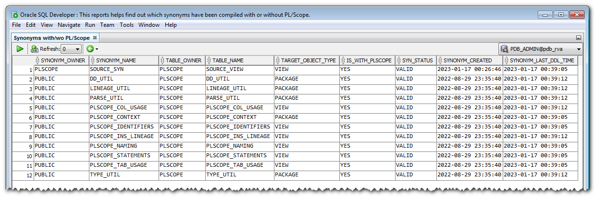

# SQL Developer Extension: plscope-utils for SQL Developer

## Introduction

The **plscope-utils for SQL Developer** extension simplifies common source code analysis tasks; it is based on PL/Scope, and provides:

- A "PL/Scope" node under each schema in the Connections tree
- A "Compile with PL/Scope..." context menu entry in the Connections tree
- Viewers for tables, views, packages, procedures, functions, triggers, types, and synonyms; these viewers are reachable via the appropriate nodes in the Connections tree, or via the "Popup Describe" context menu, when positioned on an identifier in a PL/SQL editor.
- A "plscope-utils Reports" folder in the Reports tree.

All operations are based on objects readily available in the Oracle Database, version 11.1 or higher. No database object needs to be created for using this extension. Meanwhile, many queries require the `ALL_STATEMENTS` view, available since version 12.2 of the Oracle Database.

## ToC

* [Introduction](#introduction)
* [Examples](#examples)
    * [Compile with PL/Scope](#compile-with-plscope)
    * [PL/Scope Node Viewers](#plscope-node-viewers)
      	* [Identifiers](#identifiers)
      	* [Statements](#statements)
      	* [Uses](#uses)
      	* [Used By](#used-by)
      	* [Table Usages](#table-usages)
      	* [Column Usages](#column-usages)
    * [plscope-utils Reports](#plscope-utils-reports)
      	* [CRUD Operations](#crud-operations)
      	* [Duplicate SQL Statements](#duplicate-sql-statements)
      	* [PL/SQL Naming Conventions](#plsql-naming-conventions)
      	* [Synonyms with/wo PL/Scope](#synonyms-withwo-plscope)
      	* [UDF Calls in SQL Statements](#udf-calls-in-sql-statements)
      	* [Unused Local Identifiers](#unused-local-identifiers)
* [Prerequisites](#prerequisites)
* [How to Build](#how-to-build)
* [Installation](#installation)
    * [From File](#from-file)
    * [Via Update Center](#via-update-center)
* [License](#license)


## Examples

### Compile with PL/Scope

In the Connections tree, right-click on the target connection node, then choose "Compile with PL/Scope..." in the menu, in order to open the action's dialog; the connection's user account will be used to run the action, and as the action's target.

Alternatively, navigate to the "PL/Scope" node of the target schema, right-click on that node, then choose "Compile with PL/Scope..." in the context menu. The user account of the parent connection node will be used to run the action, whereas the parent schema of the "PL/Scope" node will be its target. 


The action dialog has PL/Scope settings preset for an Oracle Database in version 12.2 or higher. If you are connected to an older version, settings which do not apply to your version will be ignored.


### PL/Scope Node Viewers

The following screenshots show the available viewers for child nodes of the "PL/Scope" node.

Each viewer has a column named "Link"; click on links in that column to open a PL/SQL editor in the specified object / cursor position.

#### Identifiers


#### Statements


#### Uses


#### Used by

Remark: this viewer is not available for type bodies and package bodies.


#### Table Usages


#### Column Usages


### plscope-utils Reports

This extension adds the "plscope-utils Reports" folder in the Reports tree.


The reports are put in 3 sub-folders:
   * 01 – Reports using ALL views
   * 02 – Reports using DBA views
   * 03 – Reports for DBAs

Reports in sub-folders "01" and "02" are identical, except that ALL\_xxx views are used in the "01" sub-folder, as opposed to DBA\_xxx views in the "02" sub-folder. Hence you should always use the "02" sub-folder if possible, unless you're only interested in analyzing your own schema, or if you don't have enough privileges on DBA\_xxx views. [^1]

[^1]: Reports in the "03 – Reports for DBAs" sub-folder, which require DBA privileges, will only be useful (if ever) to PL/Scope experts, and may  safely be ignored otherwise.

The following screenshots show an example of each report.

#### CRUD Operations


#### Duplicate SQL Statements


#### PL/SQL Naming Conventions


#### Synonyms with/wo PL/Scope



#### UDF Calls in SQL Statements


#### Unused Local Identifiers


## Prerequisites

* Oracle Database ≥ 11.1, preferrably ≥ 12.2 due to enhancements to PL/Scope in that version [^2]
* Oracle SQL Developer 4.0 or higher

[^2]: Beginning with Oracle Database version 12.2, PL/Scope also collects SQL identifiers and statement metadata for SQL statements, tables, views, and sequences in PL/SQL source codes. If connected to a prior release, the following plscope-utils features will not be available:
      (a) viewers: "Statements", "Table Usage", "Column Usage"; and:
      (b) reports: "CRUD Operations", "Duplicate SQL Statements", "UDF Calls in SQL Statements". 

## How to Build

1. [Download](https://www.oracle.com/database/sqldeveloper/technologies/download/) and install SQL Developer
2. [Download](https://maven.apache.org/download.cgi) and install Apache Maven
3. [Download](https://git-scm.com/downloads) and install a git command line client
4. Clone the plscope-utils repository
5. Open a terminal window in the plscope-utils root folder and type:
   ```
   cd sqldev
   ```
6. Run maven build by the following command:
   ```
   mvn -Dsqldev.basedir=/Applications/SQLDeveloper22.2.1.app/Contents/Resources/sqldeveloper clean package
   ```
	Amend the parameter `sqldev.basedir` to match the path of your SQL Developer installation. This folder is used to reference Oracle JAR files which are not available in public Maven repositories.
	
7. The resulting file, ```plscope-utils_for_SQLDev_x.x.x-SNAPSHOT.zip``` in the ```target``` directory, may be installed in SQL Developer.

## Installation

### From File

1. Start SQL Developer

2. Select "Check for Updates…" in the Help menu.

3. Use the "Install From Local File(s)" option to install the previously downloaded or built ```plscope-utils_for_SQLDev_*.zip``` file.

### Via Update Center

Note: this method is for _[official releases](https://github.com/PhilippSalvisberg/plscope-utils/releases)_ only; rvo-cs test builds can only be installed [from file](#from-file).

1. Start SQL Developer

2. Select "Check for Updates…" in the Help menu.

3. Click on the "Add…" button to register an update center with the following parameters:
	* Name: salvis.com
	* Location: http://update.salvis.com/

4. Choose the "Search Update Centers" option, select the "salvis.com" update center, and click "Next >" to install the latest version of plscope-utils for SQL Developer.


Remark: if you have troubles configuring the proxy settings, because your company's network requires some additional authentication or similar, then it's probably simpler to download from the [Releases](https://github.com/PhilippSalvisberg/plscope-utils/releases) page, then install using the "[from file](#from-file)" method as described above.

## License

plscope-utils is licensed under the Apache License, Version 2.0.

You may obtain a copy of the License at <http://www.apache.org/licenses/LICENSE-2.0>.
