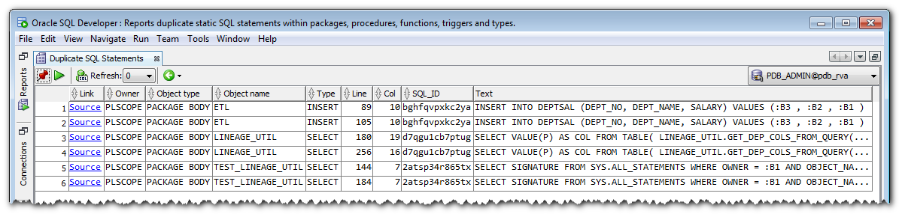

# plscope-utils for SQL Developer<br/>SQL Developer Extension

## Introduction

The **plscope-utils** SQL Developer extension simplifies common source code analysis tasks; it is based on PL/Scope, and provides:

- A "PL/Scope" node under each schema in the Connections tree
- A "Compile with PL/Scope..." context menu entry in the Connections tree
- Viewers for tables, views, packages, procedures, functions, triggers, types, and synonyms; these viewers are reachable via the appropriate nodes in the Connections tree, or via the "Popup Describe" context menu, when positioned on an identifier in a PL/SQL editor.
- A "plscope-utils Reports" folder in the Reports tree.

All operations are based on objects readily available in the Oracle Database, in version 11.1 or higher; no database object needs to be created for using this extension. However, many queries require the `ALL_STATEMENTS` view, available since Oracle Database version 12.2.

## Examples

### Compile with PL/Scope

Right click on the `Connection` or `PL/Scope` node in the Connection window to show the `Compile with PL/Scope` popup window.


The popup windows provides all relevant options for the Oracle Database version 12.2. However, if you are connected to an older version, just the applicable options are applied.


### Viewers PL/Scope Node

The following screenshots show the available viewers for objects within the PL/Scope node. Every viewer has a column named `Link`. Click on this link to open the PL/SQL editor at the corresponding cursor position.

#### Identifiers


#### Statements


#### Uses


#### Used by


#### Table Usages


#### Column Usages


### Reports

In the Reports window you find the `plscope-utils Reports` folder.


The following screenshots show an example for every report.

#### CRUD Operations


#### Duplicate SQL Statements



#### PL/SQL Naming Conventions


#### UDF Calls in SQL Statements


#### Unused Local Identifiers


## Prerequisites

* Oracle Database 11.1 or higher
* Oracle SQL Developer 4.0 or higher

## How to Build

1. [Download](http://www.oracle.com/technetwork/developer-tools/sql-developer/downloads/index.html) and install SQL Developer 17.2.0
2. [Download](https://maven.apache.org/download.cgi) and install Apache Maven 3.5.0
3. [Download](https://git-scm.com/downloads) and install a git command line client
4. Clone the plscope-utils repository
5. Open a terminal window in the plscope-utils root folder and type

		cd sqldev

6. Run maven build by the following command

		mvn -Dsqldev.basedir=/Applications/SQLDeveloper17.2.0.app/Contents/Resources/sqldeveloper clean package

	Amend the parameter sqldev.basedir to match the path of your SQL Developer installation. This folder is used to reference Oracle jar files which are not available in public Maven repositories
7. The resulting file ```plscope-utils_for_SQLDev_x.x.x-SNAPSHOT.zip``` in the ```target``` directory may be installed within SQL Developer

## Installation

### Via Update Center

1. Start SQL Developer

2. Select ```Check for Updates…``` in the help menu.

3. Press ```Add…``` to register the salvis.com update site http://update.salvis.com/.

4. Use the ```Search Update Center``` option and select the ```salvis.com update``` center to install the lastest version of ```plscope-utils for SQL Developer```.


If you have troubles to configure the proxy settings, because your company requires some additional authentication or similar, then I suggest to download plscope-utils for SQL Developer from [here](https://github.com/PhilippSalvisberg/plscope-utils/releases) and use the `Install From Local File` option as described below.

### From file

1. Start SQL Developer

2. Select ```Check for Updates…``` in the help menu.

3. Use the ```Install From Local File``` option to install the previously downloaded ```plscope-utils_for_SQLDev_*.zip``` file.

## License

plscope-utils is licensed under the Apache License, Version 2.0. You may obtain a copy of the License at <http://www.apache.org/licenses/LICENSE-2.0>.
